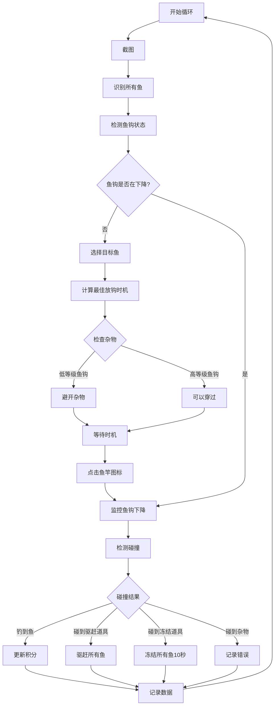

# 钓鱼游戏自动化功能实现方案

## 目录

1. [功能概述](#功能概述)
2. [游戏规则分析](#游戏规则分析)
3. [架构设计](#架构设计)
4. [技术选型](#技术选型)
5. [配置管理](#配置管理)
6. [实现步骤](#实现步骤)
7. [AI学习方案](#ai学习方案)

---

## 功能概述

实现一个实时钓鱼游戏自动化系统，能够：

- 识别鱼的位置、大小、移动方向和速度
- 跟踪鱼钩下降过程
- 检测特殊物品（驱赶道具、冻结道具、杂物）
- 根据鱼竿/鱼线等级智能决策最佳放钩时机
- 最大化钓鱼数量和总价值

## 游戏规则分析

### 基本规则

1. **玩家位置**：右边的角色
2. **鱼竿等级系统**：
   - 1级：只能钓到上半部分（浅层海域，深度 0-33%）
   - 2级：可以钓到中间（中层海域，深度 33-66%）
   - 3级：可以全部钓到最下面（深层海域，深度 66-100%）

3. **鱼的运动规律**：
   - 鱼从左出现移动到最右边消失
   - 鱼从右出现移动到最左边消失
   - 鱼的移动速度是匀速的，但不同鱼的速度可能不一样

4. **鱼钩运动**：
   - 点击右下角的鱼竿图标进行放钩
   - 鱼钩直线往下运动
   - 鱼钩移动速度是匀速的
   - 遇到鱼就会钩上来

5. **鱼的价值**：
   - 越往下的鱼价值越高
   - 钓到鱼后上面有积分显示

6. **特殊物品**：
   - **驱赶道具**（蓝色漩涡）：鱼钩碰到后驱赶屏幕内的所有鱼
   - **冻结道具**（发光蓝色物体）：鱼钩碰到后冻结所有鱼10秒
   - **杂物**（水草、木头等）：应该避免，除非鱼钩已升级

7. **鱼钩升级系统**：
   - 升级后的鱼钩有技能："穿过并获得垂钓时碰到的水草和木头"
   - 低等级鱼钩需要避开杂物
   - 高等级鱼钩可以主动穿过杂物区域

---

## 架构设计

### 1. 核心模块：`fishing_automation.py`

创建新的自动化模块，参考 `material_matcher.py` 的架构：

```python
class FishingAutomation:
    - 鱼识别和跟踪
    - 鱼钩位置检测
    - 特殊物品识别
    - 决策算法
    - 控制逻辑
    - 数据记录
```

### 2. 主要功能模块

#### 2.1 图像识别模块

**鱼识别**：使用OpenCV轮廓检测 + 颜色过滤识别鱼
- 识别鱼的位置 (x, y)
- 估算鱼的大小（轮廓面积）
- 检测移动方向（通过连续帧对比）
- 计算移动速度（像素/帧）

**鱼钩识别**：识别白色/发光的鱼钩位置
- 实时跟踪鱼钩下降轨迹
- 检测鱼钩是否到达最大深度
- 检测鱼钩是否在下降状态

**特殊物品识别**：
- 蓝色漩涡（驱赶道具）：颜色+形状匹配
- 发光蓝色物体（冻结道具）：亮度+颜色检测
- 杂物（水草、木头）：颜色+轮廓检测

#### 2.2 决策算法模块

**目标选择策略**：
- 根据鱼竿/鱼线等级确定可到达深度范围
  - 1级：浅层海域（上层，深度 0-33%）
  - 2级：中层海域（中层，深度 33-66%）
  - 3级：深层海域（下层，深度 66-100%）
- 计算每条鱼的预期价值（深度 + 大小）
- 预测鱼和鱼钩的碰撞点
- 选择最优目标（价值/时间比最高）

**时机计算**：
- 根据鱼的速度和位置，计算最佳放钩时机
- 考虑鱼钩下降时间和鱼移动时间
- 杂物处理策略：
  - 如果鱼钩等级低：避免碰撞杂物（水草、木头等）
  - 如果鱼钩已升级（有"穿过杂物"技能）：可以穿过杂物，但仍需记录

**鱼钩等级考虑**：
- 检测当前鱼钩等级和技能
- 根据鱼钩技能调整决策策略
- 升级后的鱼钩可以主动穿过杂物区域

#### 2.3 控制模块

- 点击右下角鱼竿图标
- 监控鱼钩下降过程
- 检测碰撞结果（是否钓到鱼、碰到特殊物品）
- 检测鱼钩等级和技能（可选，通过OCR或图像识别）

#### 2.4 升级系统跟踪模块（可选功能）

**捕获数量统计**：
- 记录不同类型鱼的捕获数量
- 跟踪升级条件进度（如"捕获200条小型鱼"）
- 在GUI中显示升级进度

**升级建议**：
- 分析当前装备等级
- 建议优先升级的装备
- 计算升级后的收益

---

## 技术选型

- **图像处理**：OpenCV (cv2) + PIL
- **轮廓检测**：cv2.findContours
- **颜色过滤**：HSV颜色空间
- **运动跟踪**：帧差法 + 多帧对比
- **决策算法**：贪心算法 + 碰撞预测
- **数据存储**：SQLite数据库

---

## 配置管理

在 `config.json` 中添加钓鱼游戏配置：

```json
"fishing_game": {
  "capture_region": {
    "x": 0,
    "y": 0,
    "width": 1920,
    "height": 1080
  },
  "rod_level": 3,
  "hook_level": 1,
  "fishing_icon_region": {
    "x": 0.85,
    "y": 0.85,
    "width": 0.1,
    "height": 0.1
  },
  "water_region": {
    "x": 0.1,
    "y": 0.3,
    "width": 0.8,
    "height": 0.6
  },
  "depth_zones": {
    "level_1": {"min": 0.0, "max": 0.33, "name": "浅层海域"},
    "level_2": {"min": 0.33, "max": 0.66, "name": "中层海域"},
    "level_3": {"min": 0.66, "max": 1.0, "name": "深层海域"}
  },
  "fish_detection": {
    "min_fish_area": 100,
    "max_fish_area": 5000,
    "color_ranges": {
      "hue_min": 0,
      "hue_max": 180,
      "saturation_min": 50,
      "saturation_max": 255,
      "value_min": 50,
      "value_max": 255
    }
  },
  "hook_detection": {
    "color_range": {
      "brightness_min": 200,
      "brightness_max": 255
    },
    "min_size": 10
  },
  "special_items": {
    "scare_item_color": {
      "hue_min": 100,
      "hue_max": 130,
      "saturation_min": 100,
      "saturation_max": 255
    },
    "freeze_item_color": {
      "hue_min": 100,
      "hue_max": 130,
      "brightness_min": 200
    },
    "debris": {
      "seaweed_color": {"hue_min": 40, "hue_max": 80},
      "wood_color": {"hue_min": 10, "hue_max": 30},
      "avoid_if_low_level": true
    }
  },
  "upgrade_tracking": {
    "enabled": false,
    "track_fish_count": true,
    "target_upgrades": []
  }
}
```

---

## 实现步骤

### 第一阶段：基础实现（传统算法 + 数据记录框架）

#### 1.1 核心功能实现

1. **创建基础模块** (`fishing_automation.py`)
   - 类结构设计
   - 初始化方法
   - 配置加载

2. **图像识别模块**
   - 鱼识别（颜色过滤 + 轮廓检测）
   - 鱼钩识别（亮度 + 颜色检测）
   - 特殊物品识别（模板匹配或颜色检测）

3. **运动跟踪模块**
   - 多帧对比算法
   - 速度和方向计算
   - 轨迹预测

4. **决策算法模块**
   - 目标选择（贪心算法）
   - 时机计算（碰撞预测）
   - 特殊物品处理策略

5. **数据记录模块**
   - 游戏状态记录
   - 决策记录
   - 结果记录
   - 数据库存储

6. **主程序集成**
   - 添加"钓鱼游戏"模式
   - 创建 `fishing_loop()` 方法
   - GUI集成（鱼竿等级选择下拉框）

7. **测试和优化**
   - 识别准确率测试
   - 决策效果测试
   - 性能优化

#### 1.2 数据记录框架（为AI学习做准备）

**游戏状态记录**：
```python
{
  "timestamp": "2026-02-24 16:30:00",
  "rod_level": 3,
  "hook_level": 1,
  "fish_detected": [
    {"id": 1, "x": 100, "y": 200, "size": 150, "direction": "left", "speed": 2.5, "depth": 0.3},
    ...
  ],
  "hook_position": {"x": 500, "y": 100},
  "special_items": [...],
  "decision": {
    "target_fish_id": 1,
    "hook_timing": 0.5,
    "expected_value": 30
  },
  "result": {
    "success": true,
    "fish_caught": 1,
    "score_gained": 30,
    "time_taken": 2.3,
    "hit_special_item": false
  }
}
```

**数据存储**：
- 使用SQLite数据库存储游戏记录
- 表结构：`fishing_records` (id, timestamp, game_state, decision, result, score)
- 定期导出为CSV用于分析

#### 1.3 第一阶段完成标准

- ✅ 能够识别鱼、鱼钩、特殊物品
- ✅ 能够自动放钩并钓到鱼
- ✅ 能够记录每次游戏的数据
- ✅ 基础策略能够正常工作

---

### 第二阶段：AI学习优化

#### 2.1 数据分析模块

- 分析历史游戏数据
- 计算不同策略的成功率和效率
- 识别最优参数组合

#### 2.2 机器学习模型

**模型选择**：
- 决策树/随机森林（用于策略选择）
- 线性回归（用于价值预测）
- 可选：强化学习（Q-learning）用于长期优化

**学习目标**：
- 优化目标选择策略（哪些鱼值得钓）
- 优化放钩时机（何时放钩成功率最高）
- 优化特殊物品使用策略（何时使用驱赶/冻结）

#### 2.3 策略自动更新

- 定期（如每100局）分析数据
- 自动调整决策参数
- 保存最优策略到配置文件

#### 2.4 第二阶段完成标准

- ✅ AI模型能够从数据中学习
- ✅ 策略自动优化
- ✅ 钓鱼效率显著提升

---

## AI学习方案

### 方案A：纯传统算法（推荐用于快速实现）

**优点**：
- 实现简单，响应速度快
- 不需要训练数据
- 行为可预测，易于调试
- 适合规则明确的场景

**缺点**：
- 策略相对固定，难以适应复杂情况
- 需要手动调优参数

### 方案B：AI强化学习（适合长期优化）

**优点**：
- 可以从游戏数据中学习最优策略
- 能够适应不同的游戏场景
- 可以找到人类难以发现的策略

**缺点**：
- 需要大量训练数据（游戏记录）
- 训练时间长
- 实现复杂

### 方案C：混合方案（推荐）

**基础决策**：使用传统算法（贪心/动态规划）
**策略优化**：使用AI学习最优参数
- 记录每次钓鱼的结果（成功/失败、积分、时间）
- 使用简单的机器学习模型（如决策树、随机森林）学习：
  - 不同鱼的价值权重
  - 最佳放钩时机
  - 特殊物品的使用策略
- 定期更新策略参数

---

## 决策流程图



---

## 文件结构

```
Poetry-Quiz/
├── fishing_automation.py    # 新增：钓鱼自动化核心模块
├── main.py                  # 修改：添加钓鱼模式
├── config.json             # 修改：添加钓鱼配置
├── fishing_records.db       # 新增：游戏记录数据库
└── fishing_templates/       # 新增：可选，用于模板匹配
    └── special_items/       # 特殊物品模板
```

---

## 关键算法实现

### 鱼识别算法

```python
def detect_fish(frame):
    # 1. 颜色过滤（鱼的典型颜色范围）
    # 2. 轮廓检测
    # 3. 面积过滤（排除噪声）
    # 4. 计算中心点和面积
    # 5. 与上一帧对比，计算移动方向和速度
    return fish_list  # [(x, y, size, direction, speed), ...]
```

### 碰撞预测算法

```python
def predict_collision(hook_pos, hook_speed, fish_pos, fish_speed, rod_level, hook_level, debris_list):
    # 1. 根据rod_level确定可到达深度范围
    #   - level 1: 0-33% (浅层)
    #   - level 2: 33-66% (中层)
    #   - level 3: 66-100% (深层)
    # 2. 计算鱼钩到达各深度的时间
    # 3. 计算鱼在对应时间的位置
    # 4. 检查是否在鱼竿等级范围内
    # 5. 检查是否会碰撞杂物：
    #   - 如果hook_level低：避开杂物
    #   - 如果hook_level高（有"穿过杂物"技能）：可以穿过
    # 6. 返回碰撞概率和预期价值
    return collision_info
```

---

## 总结

本方案采用两阶段实现策略：

1. **第一阶段**：使用传统算法快速实现基础功能，同时建立数据记录框架
2. **第二阶段**：通过AI学习优化策略，持续提升钓鱼效率

这种方案既保证了快速上线，又为后续优化留下了空间。

---
