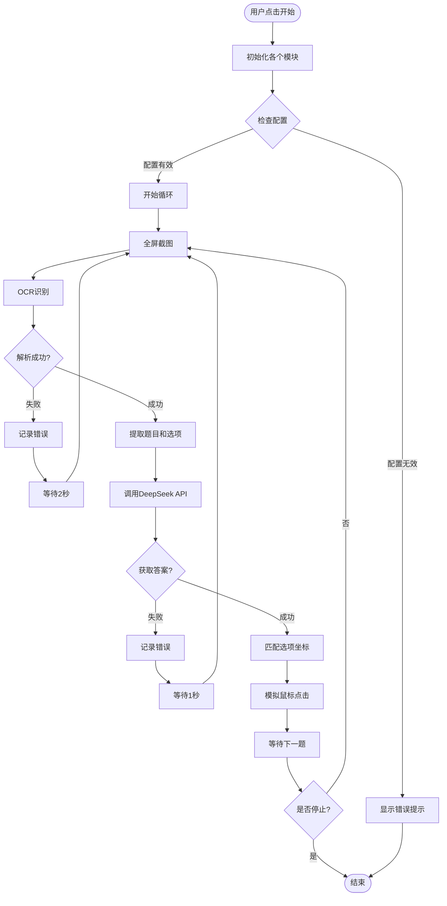

# 诗词答题自动化工具 - 详细实现方案

## 目录
1. [项目概述](#项目概述)
2. [技术选型](#技术选型)
3. [系统架构](#系统架构)
4. [模块详细设计](#模块详细设计)
5. [API接口设计](#api接口设计)
6. [配置文件设计](#配置文件设计)
7. [工作流程](#工作流程)
8. [开发步骤](#开发步骤)
9. [测试方案](#测试方案)
10. [可能遇到的问题及解决方案](#可能遇到的问题及解决方案)
11. [后续扩展](#后续扩展)

---

## 项目概述

### 项目目标
开发一个Windows桌面应用程序，能够自动识别雷电模拟器中诗词答题游戏的题目，通过AI接口获取正确答案，并自动点击正确选项。

### 核心功能
1. **屏幕截图**：实时捕获雷电模拟器窗口内容
2. **OCR识别**：识别题目和选项文字
3. **AI推理**：调用DeepSeek API获取正确答案
4. **自动点击**：根据识别结果自动点击正确选项
5. **图形界面**：提供友好的操作面板

### 应用场景
- 诗词答题游戏自动化
- 可扩展至其他答题类游戏
- 学习OCR和AI应用开发

---

## 技术选型

### GUI框架：tkinter
**选择理由**：
- Python标准库，无需额外安装
- Windows系统原生支持
- 轻量级，启动快速
- 足够满足本项目需求

**替代方案**：
- PyQt5/PySide2：功能更强大，但体积较大
- wxPython：跨平台性好，但学习曲线陡

### OCR引擎：PaddleOCR
**选择理由**：
- 对中文识别准确率高（特别是诗词等古典文本）
- 支持中英文混合识别
- 开源免费
- 提供Python API，易于集成
- 支持文本位置检测（返回坐标）

**安装方式**：
```bash
pip install paddlepaddle paddleocr
```

**性能特点**：
- 首次运行会下载模型（约100MB）
- 识别速度：单次识别约0.5-2秒
- 准确率：中文文本>95%

### 截图库：mss
**选择理由**：
- 高性能，比PIL截图快10倍以上
- 跨平台支持
- API简洁易用
- 支持多显示器

**替代方案**：
- PIL/Pillow：功能全面但速度较慢
- pyautogui.screenshot：简单但性能一般

### 鼠标控制：pyautogui
**选择理由**：
- 简单易用
- 支持相对坐标和绝对坐标
- 支持点击延迟设置
- 跨平台兼容

### AI接口：DeepSeek API
**选择理由**：
- 用户已有API Key
- 支持流式和非流式响应
- 价格相对便宜
- 中文理解能力强

**API端点**：
```
POST https://api.deepseek.com/v1/chat/completions
```

---

## 系统架构

### 整体架构图

```
┌─────────────────────────────────────────────────────────┐
│                      GUI界面层                           │
│  ┌──────────┐  ┌──────────┐  ┌──────────┐  ┌────────┐ │
│  │ 开始按钮  │  │ 停止按钮  │  │ 配置按钮  │  │ 日志区 │ │
│  └──────────┘  └──────────┘  └──────────┘  └────────┘ │
└─────────────────────────────────────────────────────────┘
                            │
                            ▼
┌─────────────────────────────────────────────────────────┐
│                    业务逻辑层                            │
│  ┌──────────────┐  ┌──────────────┐  ┌──────────────┐ │
│  │ 题目解析模块  │  │ AI客户端模块  │  │ 点击控制模块  │ │
│  └──────────────┘  └──────────────┘  └──────────────┘ │
└─────────────────────────────────────────────────────────┘
                            │
                            ▼
┌─────────────────────────────────────────────────────────┐
│                     基础服务层                           │
│  ┌──────────────┐  ┌──────────────┐  ┌──────────────┐ │
│  │ 屏幕截图模块  │  │ OCR识别模块   │  │ 配置管理模块  │ │
│  └──────────────┘  └──────────────┘  └──────────────┘ │
└─────────────────────────────────────────────────────────┘
```

### 模块依赖关系

```
main.py (GUI)
    ├── config.py (配置管理)
    ├── screen_capture.py (截图)
    ├── ocr_engine.py (OCR识别)
    ├── question_parser.py (题目解析)
    ├── ai_client.py (AI客户端)
    │   └── ai_providers/deepseek.py (DeepSeek实现)
    └── click_handler.py (点击控制)
```

---

## 模块详细设计

### 1. 主程序模块 (main.py)

#### 功能描述
- 创建GUI界面
- 协调各个模块工作
- 处理用户交互
- 显示运行状态和日志

#### 界面布局设计

```
┌────────────────────────────────────────────────────┐
│  诗词答题自动化工具                    [×] 关闭     │
├────────────────────────────────────────────────────┤
│                                                    │
│  ┌──────────────────────────────────────────────┐ │
│  │  状态：就绪                                    │ │
│  │  题目：等待识别...                             │ │
│  │  答案：-                                       │ │
│  └──────────────────────────────────────────────┘ │
│                                                    │
│  ┌──────────┐  ┌──────────┐  ┌──────────┐       │
│  │  开始运行  │  │  停止运行  │  │  配置设置  │       │
│  └──────────┘  └──────────┘  └──────────┘       │
│                                                    │
│  ┌──────────────────────────────────────────────┐ │
│  │  日志输出区域                                  │ │
│  │  [2024-01-01 12:00:00] 程序启动               │ │
│  │  [2024-01-01 12:00:01] 开始截图...            │ │
│  │  [2024-01-01 12:00:02] OCR识别中...           │ │
│  │  ...                                          │ │
│  └──────────────────────────────────────────────┘ │
│                                                    │
│  ┌──────────────────────────────────────────────┐ │
│  │  截图预览区域（可选）                          │ │
│  │  [显示当前截图]                                │ │
│  └──────────────────────────────────────────────┘ │
│                                                    │
└────────────────────────────────────────────────────┘
```

#### 核心类设计

```python
class MainWindow:
    def __init__(self):
        # 初始化GUI组件
        # 初始化各个模块
        # 绑定事件处理
        
    def start_automation(self):
        # 启动自动化流程
        # 在新线程中运行，避免阻塞UI
        
    def stop_automation(self):
        # 停止自动化流程
        
    def update_status(self, status, question, answer):
        # 更新状态显示
        
    def log_message(self, message):
        # 添加日志到显示区域
        
    def show_config_dialog(self):
        # 显示配置对话框
```

#### 线程设计
- **主线程**：GUI界面更新
- **工作线程**：执行自动化任务（截图、OCR、AI调用、点击）
- 使用`threading`模块，确保UI不卡顿

---

### 2. 配置管理模块 (config.py)

#### 功能描述
- 读取和保存配置文件
- 提供配置项访问接口
- 验证配置有效性

#### 配置文件结构 (config.json)

```json
{
  "version": "1.0.0",
  "ai_provider": "deepseek",
  "ai_providers": {
    "deepseek": {
      "api_key": "",
      "base_url": "https://api.deepseek.com/v1/chat/completions",
      "model": "deepseek-chat",
      "temperature": 0.7,
      "max_tokens": 100
    }
  },
  "ocr": {
    "language": "ch",
    "use_angle_cls": true,
    "use_gpu": false
  },
  "screen": {
    "capture_interval": 2.0,
    "full_screen": true
  },
  "click": {
    "delay_before_click": 0.5,
    "delay_after_click": 1.0,
    "click_duration": 0.1
  },
  "automation": {
    "auto_retry": true,
    "max_retry": 3,
    "retry_delay": 1.0
  }
}
```

#### 核心类设计

```python
class Config:
    _instance = None
    _config_data = None
    
    def __init__(self):
        # 单例模式
        self.config_path = "config.json"
        self.load_config()
        
    def load_config(self):
        # 从文件加载配置
        
    def save_config(self):
        # 保存配置到文件
        
    def get(self, key, default=None):
        # 获取配置项
        
    def set(self, key, value):
        # 设置配置项
        
    def validate(self):
        # 验证配置有效性
```

---

### 3. 屏幕截图模块 (screen_capture.py)

#### 功能描述
- 全屏截图
- 支持多显示器
- 返回PIL Image对象供OCR使用

#### 核心类设计

```python
class ScreenCapture:
    def __init__(self):
        self.mss_instance = mss.mss()
        
    def capture_full_screen(self):
        """
        全屏截图
        返回: PIL.Image对象
        """
        
    def capture_region(self, x, y, width, height):
        """
        区域截图
        参数:
            x, y: 左上角坐标
            width, height: 宽度和高度
        返回: PIL.Image对象
        """
        
    def capture_window(self, window_title):
        """
        捕获指定窗口（可选功能）
        参数:
            window_title: 窗口标题关键词
        返回: PIL.Image对象
        """
```

#### 实现细节
- 使用mss获取屏幕截图
- 转换为PIL Image格式（OCR需要）
- 支持保存截图到文件（调试用）

---

### 4. OCR识别模块 (ocr_engine.py)

#### 功能描述
- 初始化PaddleOCR引擎
- 识别图片中的文字
- 返回文字内容和坐标信息

#### 核心类设计

```python
class OCREngine:
    def __init__(self):
        # 初始化PaddleOCR
        self.ocr = PaddleOCR(
            use_angle_cls=True,
            lang='ch',
            use_gpu=False
        )
        
    def recognize(self, image):
        """
        识别图片中的文字
        参数:
            image: PIL.Image对象
        返回:
            list: [(文字, 坐标框), ...]
            坐标框格式: [[x1,y1], [x2,y2], [x3,y3], [x4,y4]]
        """
        
    def recognize_text_only(self, image):
        """
        只返回文字，不返回坐标（简化版）
        """
        
    def find_text_region(self, image, keyword):
        """
        查找包含关键词的区域
        参数:
            image: PIL.Image对象
            keyword: 要查找的关键词
        返回:
            dict: {'text': 文字, 'bbox': 坐标框, 'center': 中心点}
        """
```

#### OCR识别策略

1. **题目识别**：
   - 查找"题目一"、"题目二"等关键词
   - 识别其下方的诗词文字
   - 返回题目文字和大致区域

2. **选项识别**：
   - 查找"A"、"B"、"C"、"D"关键词
   - 识别每个选项后的文字
   - 返回选项文字和按钮中心坐标

3. **坐标计算**：
   - OCR返回的是文字边界框
   - 需要计算选项按钮的中心点坐标
   - 按钮通常在文字下方或右侧

#### 识别优化
- 如果全屏识别太慢，可以只识别关键区域
- 可以预先标注题目和选项的大致位置
- 使用图像预处理提高识别率（灰度化、二值化等）

---

### 5. 题目解析模块 (question_parser.py)

#### 功能描述
- 解析OCR识别的原始结果
- 提取题目文字
- 提取四个选项
- 格式化数据供AI使用

#### 核心类设计

```python
class QuestionParser:
    def __init__(self):
        self.question_keywords = ["题目一", "题目二", "题目三"]
        self.option_keywords = ["A", "B", "C", "D"]
        
    def parse(self, ocr_results):
        """
        解析OCR结果
        参数:
            ocr_results: OCR识别返回的列表
        返回:
            dict: {
                'question': '题目文字',
                'options': {
                    'A': {'text': '选项A文字', 'center': (x, y)},
                    'B': {'text': '选项B文字', 'center': (x, y)},
                    'C': {'text': '选项C文字', 'center': (x, y)},
                    'D': {'text': '选项D文字', 'center': (x, y)}
                }
            }
        """
        
    def extract_question(self, ocr_results):
        """
        提取题目
        """
        
    def extract_options(self, ocr_results):
        """
        提取选项
        """
        
    def format_for_ai(self, question_data):
        """
        格式化为AI提示词
        返回: 字符串
        """
```

#### 解析逻辑

1. **题目提取**：
   - 查找包含"题目"关键词的行
   - 提取该行下方的文字作为题目
   - 去除序号和标点符号

2. **选项提取**：
   - 查找"A"、"B"、"C"、"D"开头的行
   - 提取每个选项的完整文字
   - 记录选项按钮的中心坐标

3. **数据验证**：
   - 检查是否成功提取题目
   - 检查是否提取到4个选项
   - 如果缺失，返回错误信息

---

### 6. AI客户端模块 (ai_client.py + ai_providers/deepseek.py)

#### 架构设计
采用策略模式，支持多个AI提供商：

```
ai_client.py (抽象接口)
    └── ai_providers/
        ├── __init__.py
        ├── deepseek.py (DeepSeek实现)
        ├── openai.py (未来扩展)
        └── local.py (未来扩展)
```

#### 核心接口设计

```python
# ai_client.py
class AIClient:
    """AI客户端抽象基类"""
    
    def __init__(self, config):
        self.config = config
        
    def get_answer(self, question, options):
        """
        获取答案
        参数:
            question: 题目文字
            options: 选项字典 {'A': '选项A', 'B': '选项B', ...}
        返回:
            str: 答案选项 ('A', 'B', 'C', 或 'D')
        """
        raise NotImplementedError
```

#### DeepSeek实现 (ai_providers/deepseek.py)

```python
class DeepSeekClient(AIClient):
    def __init__(self, config):
        super().__init__(config)
        self.api_key = config['api_key']
        self.base_url = config['base_url']
        self.model = config.get('model', 'deepseek-chat')
        
    def get_answer(self, question, options):
        """
        调用DeepSeek API获取答案
        """
        # 构建提示词
        prompt = self._build_prompt(question, options)
        
        # 调用API
        response = self._call_api(prompt)
        
        # 解析响应
        answer = self._parse_response(response)
        
        return answer
        
    def _build_prompt(self, question, options):
        """
        构建AI提示词
        """
        prompt = f"""你是一个诗词专家。请根据给出的诗词上句，从以下四个选项中选择正确的下句。

题目：{question}

选项：
A. {options['A']}
B. {options['B']}
C. {options['C']}
D. {options['D']}

请只返回选项字母（A、B、C或D），不要返回其他内容。"""
        return prompt
        
    def _call_api(self, prompt):
        """
        调用DeepSeek API
        """
        headers = {
            'Content-Type': 'application/json',
            'Authorization': f'Bearer {self.api_key}'
        }
        
        data = {
            'model': self.model,
            'messages': [
                {'role': 'user', 'content': prompt}
            ],
            'temperature': 0.7,
            'max_tokens': 10
        }
        
        response = requests.post(
            self.base_url,
            headers=headers,
            json=data,
            timeout=30
        )
        
        response.raise_for_status()
        return response.json()
        
    def _parse_response(self, response):
        """
        解析API响应，提取答案
        """
        # 从响应中提取内容
        content = response['choices'][0]['message']['content'].strip()
        
        # 提取答案字母（A、B、C或D）
        import re
        match = re.search(r'[ABCD]', content.upper())
        if match:
            return match.group()
        else:
            raise ValueError(f"无法从响应中提取答案: {content}")
```

#### AI客户端工厂

```python
# ai_client.py
class AIClientFactory:
    @staticmethod
    def create_client(provider_name, config):
        """
        创建AI客户端实例
        """
        if provider_name == 'deepseek':
            from ai_providers.deepseek import DeepSeekClient
            return DeepSeekClient(config)
        else:
            raise ValueError(f"不支持的AI提供商: {provider_name}")
```

---

### 7. 点击控制模块 (click_handler.py)

#### 功能描述
- 根据坐标模拟鼠标点击
- 支持点击延迟设置
- 错误处理和重试

#### 核心类设计

```python
class ClickHandler:
    def __init__(self, config):
        self.config = config
        self.delay_before = config.get('delay_before_click', 0.5)
        self.delay_after = config.get('delay_after_click', 1.0)
        
    def click(self, x, y, button='left'):
        """
        在指定坐标点击
        参数:
            x, y: 点击坐标
            button: 'left' 或 'right'
        """
        import time
        import pyautogui
        
        # 点击前延迟
        time.sleep(self.delay_before)
        
        # 执行点击
        pyautogui.click(x, y, button=button)
        
        # 点击后延迟
        time.sleep(self.delay_after)
        
    def click_option(self, option_center):
        """
        点击选项
        参数:
            option_center: (x, y) 坐标元组
        """
        self.click(option_center[0], option_center[1])
        
    def safe_click(self, x, y, max_retry=3):
        """
        安全点击（带重试）
        """
        for i in range(max_retry):
            try:
                self.click(x, y)
                return True
            except Exception as e:
                if i == max_retry - 1:
                    raise
                time.sleep(0.5)
        return False
```

#### 坐标处理
- OCR返回的坐标是文字边界框
- 需要计算选项按钮的实际点击位置
- 按钮通常在文字下方，需要向下偏移一定像素

---

## API接口设计

### DeepSeek API调用示例

#### 请求格式
```http
POST https://api.deepseek.com/v1/chat/completions
Content-Type: application/json
Authorization: Bearer YOUR_API_KEY

{
  "model": "deepseek-chat",
  "messages": [
    {
      "role": "user",
      "content": "你是一个诗词专家。请根据给出的诗词上句，从以下四个选项中选择正确的下句。\n\n题目：兰陵美酒郁金香\n\n选项：\nA. 玉碗盛来琥珀光\nB. 夜泊秦淮近酒家\nC. 碧天如水夜云轻\nD. 依旧烟笼十里堤\n\n请只返回选项字母（A、B、C或D），不要返回其他内容。"
    }
  ],
  "temperature": 0.7,
  "max_tokens": 10
}
```

#### 响应格式
```json
{
  "id": "chatcmpl-xxx",
  "object": "chat.completion",
  "created": 1234567890,
  "model": "deepseek-chat",
  "choices": [
    {
      "index": 0,
      "message": {
        "role": "assistant",
        "content": "A"
      },
      "finish_reason": "stop"
    }
  ],
  "usage": {
    "prompt_tokens": 100,
    "completion_tokens": 1,
    "total_tokens": 101
  }
}
```

---

## 配置文件设计

### config.json 完整结构

```json
{
  "version": "1.0.0",
  "ai_provider": "deepseek",
  "ai_providers": {
    "deepseek": {
      "api_key": "sk-your-api-key-here",
      "base_url": "https://api.deepseek.com/v1/chat/completions",
      "model": "deepseek-chat",
      "temperature": 0.7,
      "max_tokens": 10
    }
  },
  "ocr": {
    "language": "ch",
    "use_angle_cls": true,
    "use_gpu": false,
    "det_db_thresh": 0.3,
    "det_db_box_thresh": 0.6
  },
  "screen": {
    "capture_interval": 2.0,
    "full_screen": true,
    "save_screenshots": false,
    "screenshot_path": "./screenshots"
  },
  "click": {
    "delay_before_click": 0.5,
    "delay_after_click": 1.0,
    "click_duration": 0.1,
    "offset_y": 20
  },
  "automation": {
    "auto_retry": true,
    "max_retry": 3,
    "retry_delay": 1.0,
    "question_detection_keywords": ["题目一", "题目二", "题目三"],
    "option_keywords": ["A", "B", "C", "D"]
  },
  "ui": {
    "window_width": 800,
    "window_height": 600,
    "log_max_lines": 100
  }
}
```

### 配置项说明

| 配置项 | 说明 | 默认值 |
|--------|------|--------|
| `ai_provider` | 当前使用的AI提供商 | "deepseek" |
| `ai_providers.deepseek.api_key` | DeepSeek API密钥 | 必填 |
| `ocr.language` | OCR识别语言 | "ch" |
| `screen.capture_interval` | 截图间隔（秒） | 2.0 |
| `click.delay_before_click` | 点击前延迟（秒） | 0.5 |
| `click.offset_y` | 选项点击Y坐标偏移 | 20 |

---

## 工作流程

### 完整流程图



### 详细步骤说明

1. **初始化阶段**
   - 加载配置文件
   - 初始化OCR引擎（首次运行会下载模型）
   - 初始化AI客户端
   - 检查API Key是否配置

2. **循环执行阶段**
   - **步骤1：截图**（约0.1秒）
     - 使用mss全屏截图
     - 转换为PIL Image
   
   - **步骤2：OCR识别**（约1-2秒）
     - 识别整个屏幕文字
     - 返回文字和坐标
   
   - **步骤3：解析题目**（约0.1秒）
     - 查找题目关键词
     - 提取题目文字
     - 提取四个选项
   
   - **步骤4：调用AI**（约1-3秒）
     - 构建提示词
     - 发送HTTP请求
     - 解析响应获取答案
   
   - **步骤5：点击选项**（约0.5秒）
     - 根据答案匹配坐标
     - 模拟鼠标点击
   
   - **步骤6：等待**（约2秒）
     - 等待下一题出现
     - 回到步骤1

3. **错误处理**
   - OCR识别失败：记录日志，等待后重试
   - AI调用失败：记录日志，等待后重试
   - 点击失败：记录日志，等待后重试
   - 超过最大重试次数：停止运行，提示用户

---

## 开发步骤

### 阶段一：项目搭建（1-2小时）

1. **创建项目结构**
   ```
   qrzuiqiangzushi/
   ├── main.py
   ├── config.py
   ├── screen_capture.py
   ├── ocr_engine.py
   ├── question_parser.py
   ├── ai_client.py
   ├── click_handler.py
   ├── ai_providers/
   │   ├── __init__.py
   │   └── deepseek.py
   ├── config.json
   └── requirements.txt
   ```

2. **创建requirements.txt**
   ```
   paddleocr>=2.7.0
   mss>=9.0.1
   pillow>=10.0.0
   pyautogui>=0.9.54
   requests>=2.31.0
   ```

3. **创建基础配置文件**
   - 创建config.json模板
   - 实现config.py基础功能

### 阶段二：核心模块开发（4-6小时）

1. **屏幕截图模块**
   - 实现全屏截图功能
   - 测试截图速度和图像质量

2. **OCR识别模块**
   - 集成PaddleOCR
   - 实现文字识别功能
   - 测试识别准确率

3. **题目解析模块**
   - 实现题目和选项提取
   - 处理OCR结果格式
   - 测试解析逻辑

### 阶段三：AI集成（2-3小时）

1. **AI客户端架构**
   - 设计可扩展接口
   - 实现工厂模式

2. **DeepSeek实现**
   - 实现API调用
   - 实现提示词构建
   - 实现响应解析
   - 测试API连接

### 阶段四：点击控制（1-2小时）

1. **鼠标控制模块**
   - 实现坐标点击
   - 实现延迟控制
   - 测试点击准确性

### 阶段五：GUI界面（3-4小时）

1. **主界面设计**
   - 设计窗口布局
   - 实现按钮和状态显示
   - 实现日志显示

2. **功能集成**
   - 整合所有模块
   - 实现线程控制
   - 实现错误处理

### 阶段六：测试和优化（2-3小时）

1. **功能测试**
   - 测试完整流程
   - 测试错误处理
   - 测试边界情况

2. **性能优化**
   - 优化OCR识别速度
   - 优化截图频率
   - 优化内存使用

3. **用户体验优化**
   - 优化界面布局
   - 添加提示信息
   - 优化日志显示

---

## 测试方案

### 单元测试

1. **配置模块测试**
   - 测试配置加载
   - 测试配置保存
   - 测试配置验证

2. **OCR模块测试**
   - 测试文字识别
   - 测试坐标提取
   - 测试识别准确率

3. **AI模块测试**
   - 测试API调用
   - 测试响应解析
   - 测试错误处理

### 集成测试

1. **完整流程测试**
   - 模拟游戏界面
   - 测试自动答题流程
   - 验证答案正确性

2. **性能测试**
   - 测试响应时间
   - 测试资源占用
   - 测试长时间运行稳定性

### 测试用例

#### 用例1：正常流程
1. 启动程序
2. 配置API Key
3. 点击开始
4. 验证自动识别和点击
5. 验证答案正确性

#### 用例2：OCR识别失败
1. 模拟OCR识别失败
2. 验证错误处理
3. 验证重试机制

#### 用例3：AI调用失败
1. 模拟API调用失败
2. 验证错误处理
3. 验证重试机制

#### 用例4：配置缺失
1. 删除配置文件
2. 启动程序
3. 验证错误提示

---

## 可能遇到的问题及解决方案

### 问题1：OCR识别不准确

**可能原因**：
- 截图质量差
- 文字区域定位不准
- OCR模型未正确加载

**解决方案**：
- 使用图像预处理（灰度化、二值化、锐化）
- 只识别关键区域，提高速度
- 使用固定坐标区域（可配置）
- 增加识别置信度阈值

### 问题2：坐标定位不准

**可能原因**：
- OCR返回的坐标是文字边界，不是按钮中心
- 不同分辨率下坐标不一致
- 窗口位置变化

**解决方案**：
- 计算文字区域中心点
- 根据按钮位置规律计算偏移
- 使用相对坐标而非绝对坐标
- 增加坐标校准功能

### 问题3：AI返回格式不规范

**可能原因**：
- AI返回了额外文字
- AI返回了多个选项
- AI返回了中文而非字母

**解决方案**：
- 使用正则表达式提取答案
- 增加答案验证逻辑
- 优化提示词，明确要求格式
- 增加答案清洗功能

### 问题4：点击位置错误

**可能原因**：
- 坐标计算错误
- 窗口位置变化
- 多显示器问题

**解决方案**：
- 增加坐标偏移配置
- 使用相对坐标
- 增加点击前坐标验证
- 支持坐标校准功能

### 问题5：程序运行缓慢

**可能原因**：
- OCR识别全屏太慢
- 网络请求延迟
- 线程阻塞

**解决方案**：
- 只识别关键区域
- 使用异步请求
- 优化OCR参数
- 增加缓存机制

### 问题6：PaddleOCR首次运行慢

**可能原因**：
- 需要下载模型文件
- 模型加载时间长

**解决方案**：
- 首次运行时提示用户
- 显示下载进度
- 使用本地模型文件

---

## 后续扩展

### 功能扩展

1. **支持更多AI提供商**
   - OpenAI GPT
   - 百度文心一言
   - 阿里通义千问
   - 本地模型（Ollama）

2. **支持更多游戏**
   - 其他答题游戏
   - 其他类型的自动化任务

3. **增强OCR功能**
   - 支持手写识别
   - 支持多语言识别
   - 支持表格识别

4. **增加统计功能**
   - 答题正确率统计
   - 答题速度统计
   - 历史记录查看

5. **增加学习功能**
   - 记录题目和答案
   - 建立本地题库
   - 优先使用本地答案

### 性能优化

1. **OCR优化**
   - 使用GPU加速
   - 使用更快的OCR引擎
   - 缓存识别结果

2. **AI优化**
   - 批量处理题目
   - 使用流式响应
   - 本地模型支持

3. **界面优化**
   - 使用更现代的GUI框架
   - 增加主题切换
   - 增加动画效果

### 部署优化

1. **打包发布**
   - 使用PyInstaller打包
   - 创建安装程序
   - 自动更新功能

2. **跨平台支持**
   - 支持macOS
   - 支持Linux

---

## 总结

本方案详细设计了一个诗词答题自动化工具，包括：

1. **完整的技术选型**：基于Python + tkinter + PaddleOCR + DeepSeek API
2. **清晰的架构设计**：模块化设计，易于扩展和维护
3. **详细的模块设计**：每个模块都有明确的功能和实现方案
4. **完善的错误处理**：考虑了各种异常情况
5. **可扩展的架构**：支持未来添加更多AI提供商

该方案可以直接用于指导开发，预计总开发时间约15-20小时。
